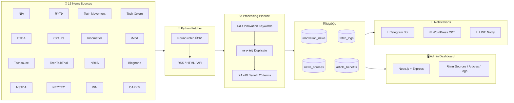

# Innovation News System

ระบบคัดเลือก วิเคราะห์ จัดเก็บ และเผยแพร่ข่าวสารด้านการวิจัยและนวัตกรรมโดยอัตโนมัติ พร้อมเชื่อมต่อ WordPress, Telegram และ LINE

อ่าน [PROJECT_HANDOFF.md](PROJECT_HANDOFF.md) ก่อนเริ่มทำงานต่อ โดยเฉพาะเมื่อนำ repository ไปใช้ในเครื่องหรือ workspace ใหม่

## ภาพรวมระบบ

ระบบดึงข่าวจาก **16 แหล่งข้อมูล** (NIA, ETDA, Techsauce, NSTDA, RYT9, iT24Hrs, TechTalkThai, NECTEC, Tech Movement, Innomatter, NRIIS, Innovation News Network, Tech Xplore, iMod, Blognone, OARKM) กรองด้วย Innovation Keywords วิเคราะห์ประโยชน์ต่อองค์กร (20 terms) แล้วเผยแพร่ผ่าน WordPress, Telegram และ LINE



| Metric | ค่า |
|--------|-----|
| แหล่งข้อมูล | 16 |
| บทความที่บันทึก | ~500+ |
| WordPress posts | ~500+ |
| Benefit terms | 20 |

ดูรายละเอียดสถาปัตยกรรมและขั้นตอนการทำงานที่ [`docs/SYSTEM-OVERVIEW.md`](docs/SYSTEM-OVERVIEW.md)

## โครงสร้างหลัก

- `scripts/` — Python fetcher, integrations, scheduler helpers และเครื่องมือ backfill
- `fetch-innovation-news/` — Node.js Admin API และ Web UI
- `tests/` — ชุดทดสอบ Python และ runtime safeguards
- `sql/migrations/` — migration notes และ schema evolution ที่ตรวจทานแล้ว
- `wordpress-plugin/` — source/reference ของ WordPress taxonomy และ search plugin
- `docs/` — คู่มือ สถาปัตยกรรม รายงาน audit และ rollout runbook

## Environment

คัดลอก `.env.example` เป็น `.env` เฉพาะบนเครื่องที่ได้รับอนุญาต แล้วกำหนดค่าจริงนอก Git ห้าม commit `.env`, tokens, passwords, Application Passwords, API keys, logs หรือ database dumps

Canonical environment ของ runtime คือ root `.env`; `scripts/.env` เป็น legacy fallback เท่านั้น

## ตรวจสอบเบื้องต้น

```bash
INNOVATION_NEWS_ENV_FILE=.env.example python3 -m unittest discover -s tests -v
python3 -m py_compile scripts/fetch-innovation-news-mysql.py scripts/wordpress_integration.py scripts/line_integration.py
cd fetch-innovation-news/api && npm ci && npm ls --omit=dev --depth=0
```

การทดสอบ integration แบบไม่ส่งข้อความ:

```bash
INNOVATION_NEWS_ENV_FILE=/absolute/path/to/.env python3 scripts/test-integrations.py
```

อย่าเพิ่ม `--send` จนกว่าต้องการส่งข้อความทดสอบจริง

## Production compatibility

- Innovation News runtime อยู่บนเครื่อง Linux รุ่นปัจจุบัน
- WordPress production แยกอีกเครื่องและยังใช้ PHP 5.6 / WordPress 6.2.9
- WordPress plugin รุ่นที่กำหนด PHP ใหม่กว่าห้ามติดตั้งบน production เดิม
- PM2 ใช้เฉพาะ Admin API; fetch jobs ใช้ OS cron

ดูรายละเอียด deployment และ rollback ใน `docs/phase0-rollout.md`

## Local development

unit tests รันจาก clean clone ได้โดยชี้ environment ไปที่ไฟล์ตัวอย่าง:

```powershell
$env:INNOVATION_NEWS_ENV_FILE=(Resolve-Path .env.example)
python -m unittest discover -s tests -v
```

ระบบเต็มรันผ่าน Docker Compose โดยใช้ MySQL และ dummy environment สำหรับ local โดยเฉพาะ ห้ามชี้ local development ไปยัง PROD database หรือใช้ PROD integration credentials

Docker Compose สำหรับ local-only development อยู่ที่ [`compose.yaml`](compose.yaml) มี sanitized schema, synthetic baseline, runtime safety overlay และ mock integrations สำหรับทดสอบ end-to-end โดยไม่กระทบ PROD เครื่องพัฒนาสามารถ restore sanitized snapshot ลง named volume ได้ โดย raw/sanitized dumps ต้องอยู่ใต้ `local-data/` ซึ่งไม่เข้า Git หรือ Docker build context ดูวิธีใช้และข้อจำกัดที่ [`docs/local-development.md`](docs/local-development.md)

Subscription form and email delivery remain feature-gated. See
[`docs/subscription-runtime.md`](docs/subscription-runtime.md) before enabling
them in any environment.
