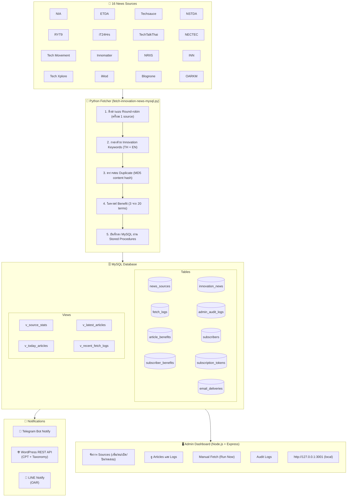

# Innovation News System — ภาพรวมระบบ

**อัปเดตล่าสุด:** 3 กันยายน 2569 (2026-09-03)
**Branch:** `plan/subscription-wordpress-email`

---

## 🎯 วิสัยทัศน์

ระบบจัดการและแจ้งเตือนข่าวนวัตกรรมและเทคโนโลยีอัตโนมัติสำหรับมหาวิทยาลัยสงขลานครินทร์
ดึงข่าวจากแหล่งข้อมูลหลากหลาย กรองด้วยคำสำคัญ วิเคราะห์ประโยชน์ต่อองค์กร
และเผยแพร่ผ่าน WordPress, Telegram และ LINE

---

## 🏗️ สถาปัตยกรรม



---

## 📰 แหล่งข้อมูล (16 Sources)

| #   | แหล่งข้อมูล                                                 | Slug                  | วิธีดึง | สถานะ     |
| --- | ----------------------------------------------------------- | --------------------- | ------- | --------- |
| 1   | สำนักงานนวัตกรรมแห่งชาติ (NIA)                              | nia                   | html    | ✅ Active |
| 2   | สำนักงานพัฒนาธุรกรรมทางอิเล็กทรอนิกส์ (ETDA)                | etda                  | rss     | ✅ Active |
| 3   | Techsauce                                                   | techsauce             | rss     | ✅ Active |
| 4   | สำนักงานพัฒนาวิทยาศาสตร์และเทคโนโลยีแห่งชาติ (NSTDA)        | nstda                 | api     | ✅ Active |
| 5   | RYT9                                                        | ryt9                  | rss     | ✅ Active |
| 6   | iT24Hrs                                                     | it24hrs               | rss     | ✅ Active |
| 7   | TechTalkThai                                                | techtalkthai          | rss     | ✅ Active |
| 8   | ศูนย์เทคโนโลยีอิเล็กทรอนิกส์และคอมพิวเตอร์แห่งชาติ (NECTEC) | nectec                | html    | ✅ Active |
| 9   | Tech Movement                                               | techmovement          | html    | ✅ Active |
| 10  | Innomatter                                                  | innomatter            | rss     | ✅ Active |
| 11  | ระบบข้อมูลสารสนเทศวิจัยและนวัตกรรมแห่งชาติ (NRIIS)          | nriis                 | rss     | ✅ Active |
| 12  | Innovation News Network                                     | innovationnewsnetwork | api     | ✅ Active |
| 13  | Tech Xplore                                                 | techxplore            | rss     | ✅ Active |
| 14  | iMod                                                        | imod                  | api     | ✅ Active |
| 15  | Blognone                                                    | blognone              | rss     | ✅ Active |
| 16  | การจัดการความรู้ สำนักวิทยบริการ ม.อ.ปัตตานี (OARKM)        | oarkm                 | rss     | ✅ Active |

---

## 🔄 ขั้นตอนการทำงาน

### 1. ดึงข่าว (Fetching)

- ดึงข่าวแบบ **Round-robin** ครั้งละ 1 source
- รองรับ 3 วิธี: RSS, HTML scraping, REST API
- จัดการโดย OS cron (ทุก 30 นาที)

### 2. กรองข่าว (Filtering)

- ตรวจสอบด้วย **Innovation Keywords** ทั้งภาษาไทยและอังกฤษ
- ตรวจสอบวันที่ (ไม่เกิน 1 ปี)
- ตรวจสอบความซ้ำด้วย **MD5 content hash** (title + link)

### 3. วิเคราะห์ประโยชน์ (Benefit Analysis)

- เลือก 3 benefits จาก 20 controlled terms
- ใช้ keyword matching กับ title + summary
- แสดงเป็น emoji + ข้อความใน notification

### 4. บันทึกข่าว (Storage)

- บันทึกลง MySQL ผ่าน Stored Procedures
- บันทึก logs ทุกการ fetch
- อัปเดต stats ของแต่ละ source

### 5. ส่งการแจ้งเตือน (Notification)

- **Telegram**: ส่งสรุป + ประโยชน์ + ลิงก์
- **WordPress**: สร้างโพสต์ `innovation-tip` พร้อม benefit taxonomy
- **LINE**: ส่งลิงก์ WordPress post

### 6. Admin Dashboard

- จัดการ sources แบบ dynamic
- ทดสอบ source ก่อนเปิดใช้งาน
- ดู articles, logs, audit trail
- Manual fetch (Run Now)

---

## 🏷️ Benefit Taxonomy (20 Terms)

| #   | Benefit                                   | Emoji |
| --- | ----------------------------------------- | ----- |
| 1   | ความสามารถในการแข่งขัน                    | 🏆    |
| 2   | การลดต้นทุนและเพิ่มประสิทธิภาพ            | ⚡    |
| 3   | การปรับตัวสู่ดิจิทัลทรานส์ฟอร์เมชัน       | 💻    |
| 4   | การพัฒนาทักษะและการเรียนรู้               | 🎓    |
| 5   | การใช้งาน AI และเทคโนโลยีขั้นสูง          | 🤖    |
| 6   | ความปลอดภัยและความเป็นส่วนตัว             | 🛡️    |
| 7   | การสร้างนวัตกรรมและการเปลี่ยนแปลง         | 🚀    |
| 8   | การปรับตัวต่อเทรนด์และตลาด                | 📊    |
| 9   | การจัดการข้อมูลและวิเคราะห์ข้อมูล         | 🔍    |
| 10  | การสร้างประสบการณ์ลูกค้าและบริการ         | 🤝    |
| 11  | การเชื่อมต่อและการทำงานร่วมกัน            | 👥    |
| 12  | การพัฒนาเทคโนโลยีและโครงสร้าง             | 💼    |
| 13  | การสนับสนุนนวัตกรรมและสตาร์ทอัพ           | 🚀    |
| 14  | การประยุกต์บล็อกเชนและเทคโนโลยีทางการเงิน | 💰    |
| 15  | การใช้เทคโนโลยีสีเขียวและยั่งยืน          | 🇪🇺    |
| 16  | การพัฒนาสุขภาพและการดูแลโรงพยาบาล         | 🏥    |
| 17  | การใช้ปัญญาประดิษฐ์แบบสร้างสรรค์          | 🤖    |
| 18  | การพัฒนาภาคศึกษาและเมืองอัจฉริยะ          | 🎯    |
| 19  | การทำธุรกิจในยุคดิจิทัล                   | 📈    |
| 20  | การวิจัยและพัฒนาองค์ความรู้               | 🔬    |

---

## 🛡️ Security & Feature Gates

### Feature Flags (ปิดโดย default)

| Flag                      | ค่าเริ่มต้น | คำอธิบาย                          |
| ------------------------- | ----------- | --------------------------------- |
| `ENABLE_SUBSCRIPTION_API` | `0`         | เปิด Subscription API             |
| `ENABLE_EMAIL_WORKER`     | `0`         | เปิด Email Worker                 |
| `EMAIL_SEND_MODE`         | `disabled`  | โหมดส่งอีเมล (disabled/json/smtp) |
| `DRY_RUN`                 | `false`     | โหมดทดสอบ (ไม่ส่งจริง)            |

### Security Controls

- Credentials อยู่ใน `.env` เท่านั้น (ห้าม commit)
- HTTPS only สำหรับ source URLs
- Token-based authentication สำหรับ Admin
- Rate limiting สำหรับ subscription API
- CORS allowlist สำหรับ WordPress origins
- Audit logs สำหรับทุก admin action

---

## 🐳 Local Development

### Docker Compose Services

- `mysql` — MySQL 8.0 database
- `mock-integrations` — Mock services สำหรับทดสอบ
- `admin` — Admin Dashboard (Node.js)
- `gateway` — API gateway

### Quick Start

```bash
# รัน Docker services
docker compose up -d

# เข้า Admin Dashboard
open http://127.0.0.1:3001

# รัน tests
INNOVATION_NEWS_ENV_FILE=.env.example python3 -m unittest discover -s tests -v
```

---

## 📦 Production Deployment

### PROD Environment

- **Admin API**: `http://192.168.160.19:3001/`
- **Workspace**: `/home/kittisak/.openclaw/workspace`
- **Process Manager**: PM2 (สำหรับ Admin API เท่านั้น)
- **Scheduler**: OS cron (สำหรับ fetch jobs)

### Deployment Process

1. ตรวจสอบ diff และ tests
2. สำรอง PROD ก่อน deploy
3. Deploy ผ่าน controlled rollout
4. ตรวจสอบ health checks
5. Rollback ถ้ามีปัญหา

ดูรายละเอียดใน `docs/phase0-rollout.md`

---

## 📂 โครงสร้างโปรเจกต์

```
innovation-news-system/
├── scripts/                          # Python scripts
│   ├── fetch-innovation-news-mysql.py  # Fetcher หลัก
│   ├── wordpress_integration.py        # WordPress sync
│   ├── line_integration.py             # LINE notification
│   └── *.py                            # Utility scripts
├── fetch-innovation-news/            # Node.js Admin
│   ├── api/
│   │   ├── server.js                   # Admin API
│   │   └── email-worker.js             # Email worker
│   └── public/
│       └── index.html                  # Admin UI
├── sql/
│   └── migrations/                   # Database migrations
├── docker/
│   └── mysql/init/                   # Local DB init scripts
├── wordpress-plugin/                 # WordPress plugins
├── tests/                            # Test suites
├── docs/                             # Documentation
│   ├── archive/                      # Archived docs
│   └── fetch-innovation-news/        # Admin docs
├── local-data/                       # Local data (gitignored)
│   └── prod-snapshot/                # PROD snapshots
├── compose.yaml                      # Docker Compose
├── PROJECT_HANDOFF.md                # Handoff guide
└── README.md                         # Project README
```

---

## 📊 สถิติระบบ

| Metric                  | ค่า   |
| ----------------------- | ----- |
| แหล่งข้อมูลที่เชื่อมต่อ | 16    |
| บทความที่บันทึก         | ~500+ |
| WordPress posts         | ~500+ |
| Admin Dashboard users   | 1     |
| Benefit terms           | 20    |
| Stored procedures       | 10+   |

_ข้อมูล ณ 28 ส.ค. 2026 จาก PROD snapshot (`local-data/prod-snapshot/`)_

---

## 🔗 เอกสารที่เกี่ยวข้อง

| เอกสาร                                      | คำอธิบาย                 |
| ------------------------------------------- | ------------------------ |
| `PROJECT_HANDOFF.md`                        | คู่มือส่งมอบโปรเจกต์     |
| `docs/INNOVATION-NEWS-KANBAN.md`            | Kanban roadmap           |
| `docs/local-development.md`                 | Docker local dev guide   |
| `docs/phase0-rollout.md`                    | Phase 0 deployment guide |
| `docs/subscription-wordpress-email-plan.md` | Subscription plan        |
| `docs/wordpress-benefit-taxonomy.md`        | Benefit taxonomy details |
| `docs/fetch-innovation-news/`               | Admin documentation      |

---

## 📝 Changelog

### 2026-09-03

- อัปเดตเอกสารภาพรวมระบบ
- ย้ายเอกสารเก่าไป `docs/archive/`
- สร้างเอกสารใหม่แทน `INNOVATION-NEWS-SYSTEM.md`

### 2026-08-28

- Phase 0 deployment สำเร็จ
- Docker local development environment
- WordPress benefit taxonomy (20 terms)

### 2026-04

- LINE integration
- Admin Dashboard development

### 2026-03

- Initial system setup
- 10 sources → 16 sources
- MySQL database + stored procedures
- WordPress integration
- Telegram notification
